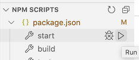

# LearnJS Exercise Tester

**LearnJS** is a web application for JavaScript exercises with test cases, written in React. Download,
install and run this application locally to see the exercises, write solutions, and test them.

## Requirements

You need up-to-date versions of the following installed:

* [git](https://git-scm.com/book/en/v2/Getting-Started-Installing-Git)
* [node](https://nodejs.org/en/download/)

Recommended for editing code:

* [Visual Studio Code](https://code.visualstudio.com/download) 

Also, you need to know how to open in a terminal window and run basic shell commands.

* On a MacIntosh, use the **Terminal** application. [Terminal Beginners Tutorial](https://academind.com/tutorials/terminal-zsh-basics/)
* On Windows, use the **Git Bash** application. It's installed with Git for Windows. [Command Line Interace Tutorial (with Git Bash)](https://www.youtube.com/watch?v=sw9kdFka8rA)

## Installing LearnJS

Create a directory where you will keep your code projects. 

Open a terminal commmand window and **cd** to that directory. Enter the following three commands.

```
git clone https://gitlab.com/criesbeck/learn-js.git
cd learn-js
npm install
```

The first line downloads the LearnJS code. The second line moves you into the code directory.
The last line installs Node library modules. This will take for several minutes.

## Running

Since the point of this application is to edit and test code, it makes sense to run LearnJS
inside your editor, if it supports that. VS Code does.

If you have VS Code installed, start it. Use **File | Open** to open the *learn-js* directory.

VS Code should create clickable buttons in the lower left for various tasks, like this



If you see it, click the triangular run icon next to **start**. If you don't see it, use ** View | Terminal ** to open a terminal window manually, and enter

```
npm run start
```

Either way will start a local React web server. This may take a minute, then the LearnJS
web page will open.

## The LearnJS interface

The LearnJS Exercise Tester web page shows a list of JavaScript exercise modules,
[like this](https://criesbeck.gitlab.io/learn-js/). Each module contains exercises to do.

The color of the module name indicates the status of the exercises in it:

* <span style="color:red">red</span> means one or more exercises in the block have failing test cases.
* <span style="color:green">green</span> means all the exercises in the block are done.
* <span style="color:orange">orange</span> means some of the exercises in block are done.
* <span style="color:gray">gray</span> means none of the exercises in the block have been started.

Click on a module name to see the exercises it contains. Click on an exercise to
see what it's supposed to do, and its test cases.

For example, the first module is in <span style="color:red">red</span>. That
means one or more of its exercises have tests that fail.

Click on the first module to open it up. That will show that the **rectPerimeter** exercise is
<span style="color:red">red</span>. 

Click on **rectPerimeter** to see a description of the exercise. Every exercise has a brief
description of the function to be defined, some material to read relevant to solving
the problem, and a table of test cases that the solution must pass. Each test case has:

* an example call to the function
* the value that should be returned by the function
* the value that the current solution returns, if a solution has been defined

**rectPerimeter(x, y)** is supposed to take the dimensions of a rectangle and return
the perimeter, but it returns the wrong answer in both cases. 

## Editing solutions

This section assumes you have looked at what JavaScript code looks like. See the
[#resources](#resources) for introductions to JavaScript.

To see how **rectPerimeter** is currently defined, open the file **src/solutions.js** in
your text editor. The initial definition there is

```
export const rectPerimeter = (x, y) => x + y;
```

This definition of **rectPerimeter** fails because it just adds **x** and **y**. It needs to return twice that amount. Edit the definition to be

```
export const rectPerimeter = (x, y) => 2 * (x + y);
```

Save the file and go back to the web page again. It should have updated automatically. 
The **rectPerimeter** test cases should now all be green.

The name of the first module should now be <span style="color:orange">orange</span>, because it has no failing cases, but it does have exercises with no solutions.

## Exercise guidelines

Solutions are functions. They must be 
exported for the tester to see them, as was shown with **rectPerimeter**.

Feel free to define helper functions. They do not need to be exported.

Use arrow syntax to define functions.

Unless required by the exercise, solutions should not

* destructively modify input objects
* print anything


## Resources

[Hello, JavaScript!](https://courses.cs.northwestern.edu/394/guides/intro-js.php) is
the primary resource for these exercises. It covers just the parts you need to know for 
the exercises and to get started with React programming.

For a much longer introduction to JavaScript, see  [The Modern JavaScript Tutorial](https://javascript.info/). Note that to be complete it covers many features in JavaScript that are no longer 
recommended practice. 

A good reference for specific details about various JavaScript functions and methods is  
[the Mozilla Developer  site](https://developer.mozilla.org/en-US/).


## Authors

* **Chris Riesbeck** - [home page](https://users.cs.northwestern.edu/~riesbeck/)


## License

This project is licensed under the MIT License - see the [LICENSE.md](LICENSE.md) file for details.
